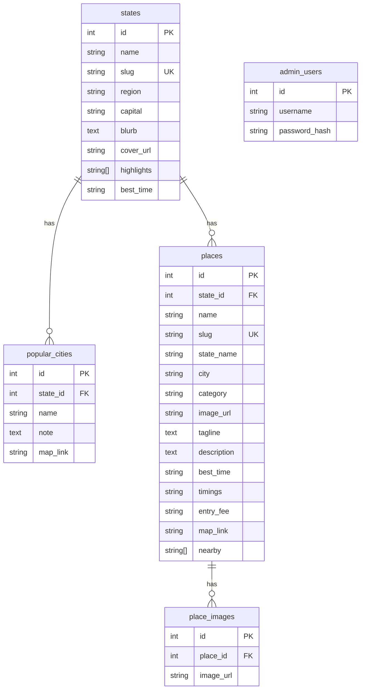

# Product Requirement Document (PRD) — TravelBharat

## 1. Product Overview
**TravelBharat** is a centralized tourism information web platform designed to provide state-wise and city-wise details of tourist destinations across India. It serves as a digital travel encyclopedia, presenting users with verified destination details, rich imagery, local insights, and an admin management system for content updates.

---

## 2. Objectives
### Primary Objectives
* Provide a single, consolidated platform for all Indian tourism details.
* Structure destinations state-wise and city-wise for easy navigation.
* Deliver accurate, verified details (overview, timings, fees, locations).
* Offer a responsive and fast-loading web user interface.

### Secondary Objectives
* Showcase lesser-known regional destinations.
* Provide an educational resource for students and researchers.
* Maintain a secure admin panel for CRUD content moderation.
* Support scalable system architecture for future booking integrations.

---

## 3. Product Scope
### In-Scope
* **State Listings**: Browse states/UTs by region with details (capital, best time, highlights).
* **Destination Pages**: Detailed description, category, timings, fees, nearby attractions, map link.
* **Search & Filters**: Search destinations by name, city, or state; filter by categories (Heritage, Nature, Religious, Adventure, Beach).
* **Multi-Image Gallery**: Visual slideshow/media grids for destinations.
* **Admin Management**: Secure login (JWT) to create, update, and delete states and destinations.

### Out of Scope (Future Phase)
* Live booking (hotels, flights, packages).
* User reviews and community features.
* Interactive map exploration (optional/future expansion).

---

## 4. Entity Schema Model

---

## 5. API Catalog

### Public Routes
* `GET /api/states` — Lists all states (name, region, cover).
* `GET /api/states/:slug` — Gets detail of a state, popular cities, and associated places.
* `GET /api/places` — Lists destinations; supports `?q=&category=&state=`.
* `GET /api/places/:slug` — Gets place details (tagline, description, gallery images, nearby list, map link, related).

### Admin Routes (Protected by JWT Bearer token)
* `POST /api/auth/login` — Login with username/password, returns JWT.
* `GET /api/auth/verify` — Validates admin token.
* `POST /api/states` / `PUT /api/states/:id` / `DELETE /api/states/:id` — CRUD for states.
* `POST /api/places` / `PUT /api/places/:id` / `DELETE /api/places/:id` — CRUD for destinations.
